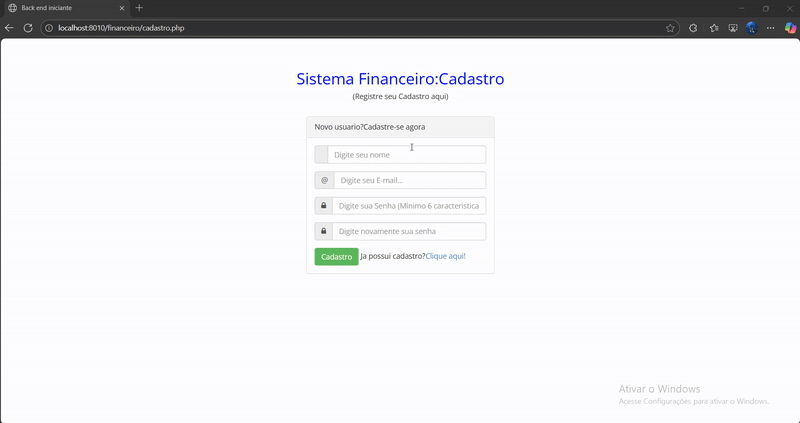

# 💰 Controle Financeiro

Este é o meu **primeiro projeto pessoal**, desenvolvido com o objetivo de praticar e me familiarizar com algumas tecnologias do desenvolvimento web.  

O sistema permite gerenciar **finanças pessoais**, oferecendo funcionalidades como:  
- Cadastro de **categorias** (ex: Alimentação, Transporte, Lazer).  
- Cadastro de **empresas** (ex: Supermercado X, Farmácia Y).  
- Cadastro de **contas** (ex: Banco do Brasil, Carteira).  
- Registro de **movimentações financeiras** (entradas e saídas).  

---

## 🚀 Tecnologias utilizadas

- **PHP** → Back-end  
- **MySQL** → Banco de dados relacional  
- **HTML5 & CSS3** → Estrutura e estilos  
- **Bootstrap** → Layout responsivo  
- **jQuery** → Validações e interatividade  

---

## 🎯 Objetivo do projeto

Este projeto tem como principal objetivo:  
- Colocar em prática os conhecimentos adquiridos em **PHP e MySQL**.  
- Aprender a estruturar um projeto **full stack simples**.  
- Aprender a utilizar o **Bootstrap** e o **jQuery** para melhorar a experiência do usuário.  

---

## 📌 Observações

- Este repositório é um **exercício de aprendizado**, não sendo ainda um sistema pronto para uso em produção.  
- Futuramente pretendo evoluir o projeto com **novas funcionalidades** e **boas práticas** de desenvolvimento.  

---

## 📷 

---

## 👨‍💻 Autor

Desenvolvido por **Vitor Correia** como parte do meu aprendizado em desenvolvimento web.  
